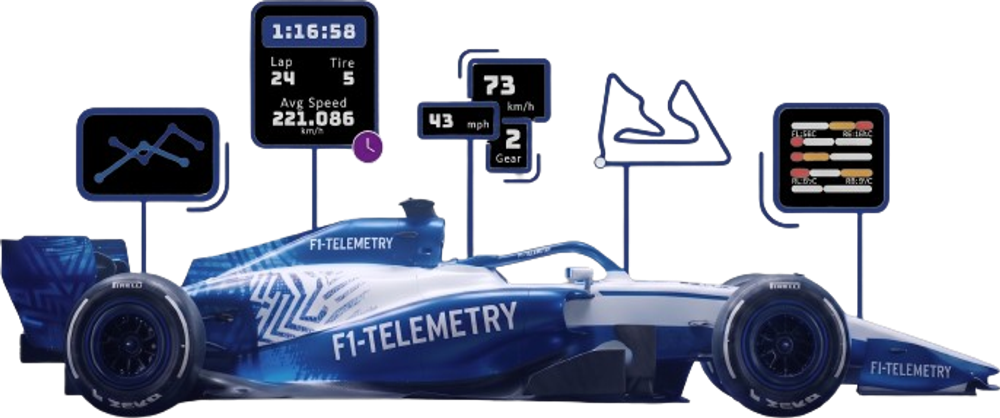

<p align="center">
  
</p>

<h1 align="center">F1-Telemetry</h1>

<p align="center">
  <strong>Interactive Formula 1, F2 &amp; F1 Academy race analytics — powered by real telemetry data.</strong>
</p>

<p align="center">
  <a href="https://deepwiki.com/MatthewDelong/F1-Telemetry">📖&nbsp;Project&nbsp;Wiki</a>&nbsp;&nbsp;·&nbsp;&nbsp;
  <a href="https://f1-telemetry.matthews-world.co.uk/">🌐&nbsp;Live Site</a>&nbsp;&nbsp;·&nbsp;&nbsp;
  <a href="#features">✨&nbsp;Features</a>&nbsp;&nbsp;·&nbsp;&nbsp;
  <a href="#tech-stack">🛠&nbsp;Tech&nbsp;Stack</a>&nbsp;&nbsp;·&nbsp;&nbsp;
  <a href="#getting-started">🚀&nbsp;Getting&nbsp;Started</a>&nbsp;&nbsp;·&nbsp;&nbsp;
  <a href="#license">📄&nbsp;License</a>
</p>

<p align="center">
  <strong>Explore the <a href="https://deepwiki.com/MatthewDelong/F1-Telemetry">intensive project wiki</a> for in-depth documentation, technical architecture, and developer insights.</strong>
</p>

---

## About

F1-Telemetry is a fork of the original [f1nsight](https://github.com/adityakotha03/F1nsight) project, refactored to **React 19** and **Vite 8** with additional features and enhancements. It's an interactive web application built for motorsport fans who want to go deeper than the broadcast — providing detailed race analytics, real-time telemetry visualisation, driver comparisons, and a 3D race viewer across **Formula 1**, **Formula 2**, and **F1 Academy**.

> **Attribution** — This project builds upon the work of the original f1nsight developers. Data is now powered by the official **[OpenF1 API](https://openf1.org)** and **[Jolpica API](https://jolpi.ca/)**.

---

## Features

| Feature                 | Description                                                                                              |
| ----------------------- | -------------------------------------------------------------------------------------------------------- |
| **Race Leaderboards**   | Comprehensive race results with position changes, intervals and gap analysis                             |
| **Lap-Time Analysis**   | Lap-by-lap performance metrics for studying consistency and strategy                                     |
| **Tire Strategies**     | Visual breakdown of compound choices and stint lengths across the grid                                   |
| **Fastest Laps**        | Highlights of the quickest laps set during each session                                                  |
| **Pit Stop Analytics**  | Scatter-chart visualisation of pit-stop durations per driver                                             |
| **Driver Comparisons**  | Head-to-head telemetry overlays for any two drivers in a session                                         |
| **3D Telemetry Viewer** | Follow drivers around the circuit in a synchronised 3D scene with multiple broadcast-style camera angles |
| **AR Car Viewer**       | High-fidelity 3D car models with Draco / Meshopt compression (90 MB → 23 MB)                             |
| **2026 Race Calendar**  | Up-to-date schedule covering F1                                                                          |

---

## Tech Stack

| Layer             | Technologies                                      |
| ----------------- | ------------------------------------------------- |
| **Framework**     | React 19 · Vite 8 · React Router 7                |
| **Styling**       | Tailwind CSS 4 · Flowbite React                   |
| **3D / Graphics** | Three.js · `@google/model-viewer` · Tween.js      |
| **Data Viz**      | Recharts · D3.js                                  |
| **Animation**     | Framer Motion · Lottie                            |
| **Backend / API** | Local PHP Gateway (`api.php`) · Node.js Proxy     |
| **Tooling**       | PWA (vite-plugin-pwa) · Sitemap generation · SVGR |

---

## Getting Started

### Prerequisites

- **Node.js** ≥ 18
- **npm** ≥ 9

### Install & Run

```bash
# Clone the repo
git clone https://github.com/your-username/F1-Telemetry.git
cd F1-Telemetry

# Install dependencies
npm install

# Install dependencies
cd backend
npm install
cd..

# Start the dev server
npm run dev
```

The app will be available at **http://localhost:3006** (or the port shown in your terminal).

### Production Build

```bash
npm run build
npm run preview   # preview the production build locally
```

---

## Developer Workflow

<details>
<summary><strong>AR Model Compression</strong></summary>

Optimize `.glb` files added to `public/ArFiles/glbs/` for web delivery:

```powershell
npm run compress-models
```

Script: `scripts/robust-compress-glbs.ps1` (requires PowerShell & Node.js).

</details>

<details>
<summary><strong>Transparent Video System (Luma Key)</strong></summary>

Videos use a custom **Luma Key** pipeline for cross-browser transparency:

- Videos are encoded in a _side-by-side_ layout — **left half = RGB**, **right half = alpha mask**.
- The `LumaKeyVideo` component composites both halves onto a `<canvas>` at runtime.

**Generate a side-by-side asset from a PNG sequence:**

```powershell
& "node_modules/ffmpeg-static/ffmpeg.exe" -y -i "input_%05d.png" `
  -filter_complex "[0:v]pad=w=iw:h=ceil(ih/2)*2,split[v1][v2]; [v2]alphaextract[alpha]; [v1][alpha]hstack" `
  -c:v libx264 -crf 18 -pix_fmt yuv420p "output.mp4"
```

> The `pad` filter ensures the height is divisible by 2 for H.264 compatibility.

</details>

<details>
<summary><strong>Driver Image Background Removal</strong></summary>

Remove backgrounds from F2 driver headshots for a consistent look:

```bash
npm run remove-f2-bg
```

To process a different directory, edit the `dirs` array in `scripts/remove-backgrounds.mjs`.  
Uses `@imgly/background-removal-node` for automatic detection.

</details>

<details>
<summary><strong>Local Decoders</strong></summary>

Draco and Meshopt decoders are bundled locally in `public/decoders/` to bypass browser Tracking Prevention and ensure 100 % reliability.

</details>

<details>
<summary><strong>API Data Update Script</strong></summary>

The project includes a Python script (`src/config/f1/api_update.py`) that fetches the latest F1 season data from the [Jolpica API](https://jolpi.ca/) and [OpenF1 API](https://openf1.org) and writes it into the local JSON config files.

**Prerequisites**

- **Python** ≥ 3.8 — on Windows use the `py` launcher (avoids Microsoft Store alias issues)
- Install the required Python packages (this uses `pip`, Python's own package manager — separate from npm):

```bash
py -m pip install requests numpy
```

**Running the script**

The script **must** be run from within its own directory so that relative file paths resolve correctly:

```bash
cd src/config/f1
python api_update.py
```

**What it updates**

| File                                     | Description                                       |
| ---------------------------------------- | ------------------------------------------------- |
| `results.json`                           | Race results for every completed round            |
| `qualifying.json`                        | Qualifying session results (Q1 / Q2 / Q3 times)   |
| `sprint.json`                            | Sprint race results (sprint weekends only)        |
| `races/races.json`                       | Race calendar with meeting keys                   |
| `races/{year}/driverStandings.json`      | Cumulative driver standings after each round      |
| `races/{year}/constructorStandings.json` | Cumulative constructor standings after each round |
| `drivers/`                               | Per-driver career statistics and analytics        |
| `constructors/`                          | Constructor and driver rosters                    |

> **Note:** The script includes automatic retry logic with exponential back-off for rate-limited (429) API responses. A full update run may take a few minutes depending on how many rounds have been completed.

</details>

<details>
<summary><strong>OpenF1 API Rate Limiting (429) Mitigation</strong></summary>

To ensure uninterrupted telemetry viewing during periods of high OpenF1 API traffic, several client-side strategies have been implemented to reduce and handle `429 Too Many Requests` errors:

- **Exponential Backoff Retries**: Core API calls utilize an automatic retry queue starting with a 1500ms delay, doubling on each subsequent 429 response (up to 7 retries).
- **Stale Cache Fallback**: The persistent `localStorage` cache handles API outages gracefully. If a network request fails (including terminal 429s), the application will fall back to expired cache data instead of breaking the UI.
- **Paced Pagination**: Bulk data fetches bypass standard 500-record limits by paginating via timestamps, explicitly injecting a 300ms delay between batch requests to prevent rate limit spikes on the OpenF1 servers.

</details>
<details>  
<summary><strong>Hybrid API Proxy Environment</strong></summary>

F1-Telemetry features a fully decoupled, hybrid API backend to ensure permanent stability even if external bespoke APIs are taken offline:

- **Local Development**: Running `npm run dev` starts both the Vite frontend and a local Node.js Express server (`backend/server.js`) connected to a SQLite caching database.
  - **`backend/database.sqlite`**: The primary development and administrative cache. It stores JSON responses from external APIs (Jolpica, OpenF1) to facilitate local testing and the **data export workflow**. While not used at runtime in production, it is essential for rebuilding the static datasets that the live site relies on.
  - **`database.sqlite` (root)**: A legacy or baseline cache file. It is not used in the current production runtime and primarily serves as a historical reference or remains from earlier project structures.
- **Production Server**: When built for production, the Vite code automatically switches routing to a native `api.php` file, which seamlessly caches and routes data directly on IONOS Shared Web Hosting via file-based storage.
  - **`public/api_cache/`**: The production caching directory. It stores API responses as static files to ensure the live site remains fast and stable even if external data sources are unavailable. This directory is excluded from version control.

</details>

<details>
<summary><strong>Content Security Policy (CSP)</strong></summary>

To enhance application security and mitigate Cross-Site Scripting (XSS) attacks, a strict Content Security Policy (CSP) is implemented.

Key aspects of our CSP configuration:

- **API Endpoints**: Explicitly whitelists connections to authorized data sources including the OpenF1 API (`api.openf1.org`), Jolpica API (`api.jolpi.ca`), OpenWeather API, and GitHub Raw Content.
- **Assets & Media**: Restricts image and media loading to the application origin and verified third-party providers (e.g., Flagpedia for driver flags).
- **Scripts**: Restricts script execution to the application origin, preventing unauthorized external scripts from running while allowing trusted analytics providers.
- **Enforcement**: Depending on the hosting environment (e.g., IONOS or Cloudflare), the CSP headers are actively enforced at the proxy/edge layer to ensure all browsers securely enforce the policy without manual intervention.

</details>

---

## Deployment

F1-Telemetry is deployed as a static site on IONOS. Key deployment notes:

1. The `.htaccess` in `public/` must be deployed at the web root to enable **Gzip compression** for `.glb` files.
2. The `public/decoders/` folder must be included in the build output to avoid cross-domain script blocking.
3. Ensures that the `public/api.php` endpoint transfers cleanly to your root build directory structure. This PHP file functions as the dedicated caching layer and API proxy when hosted on IONOS Web Hosting Plus.

---

## Data Sources

This project pulls data from four sources:

- **[OpenF1 API](https://openf1.org)** — Real-time and historical telemetry, track positioning, and stint data.
- **[Jolpica API](https://jolpi.ca/)** — Custom local backend parser fetches F1 historical Race results, Driver Standings, and Constructor Standings directly from the reliable Jolpica API framework.
- **[OpenWeather API](https://openweathermap.org/)** — Weather data.
- **Internal Gateway (`api.php`)** — A custom auto-caching proxy ensures that Formula 2 and F1 Academy data remains completely decoupled and safe from disappearing online, using internal fallbacks over volatile GitHub Pages databases.

---

## Contributing

Contributions are welcome! Whether it's improving the codebase, adding features, or fixing bugs — feel free to fork the repo and open a pull request.

---

## Acknowledgements

- Thanks to all the Formula 1 fans and community contributors who keep this project running!
- Special thanks to data providers and API service [OpenF1](https://openf1.org/) that enable access to current and historical F1 data.
- [Flagpedia](https://flagpedia.net/) — High-quality country flag WebP images used for race locations and driver nationalities.
- This work is based on "basic Lowpoly F1 Car V1" by arthihalder, available under a Creative Commons Attribution 4.0 International license. [View the model on Sketchfab](https://sketchfab.com/3d-models/basic-lowpoly-f1-car-v1-b4c6a1cfe0154f4d86b39ff3b7f955a1). License details can be found at [CC-BY-4.0](http://creativecommons.org/licenses/by/4.0/).

---

## License

This project is available under a [custom open-source license](LICENSE.md) — free for non-commercial use with attribution.

---

## Disclaimer

F1-Telemetry is an **unofficial** fan project and is not associated with Formula One companies. _F1, FORMULA ONE, FORMULA 1, F2, FORMULA 2, FIA, FIA FORMULA 2 CHAMPIONSHIP, F1 ACADEMY, FIA FORMULA ONE WORLD CHAMPIONSHIP, GRAND PRIX_, and related marks are trademarks of Formula One Licensing B.V.
